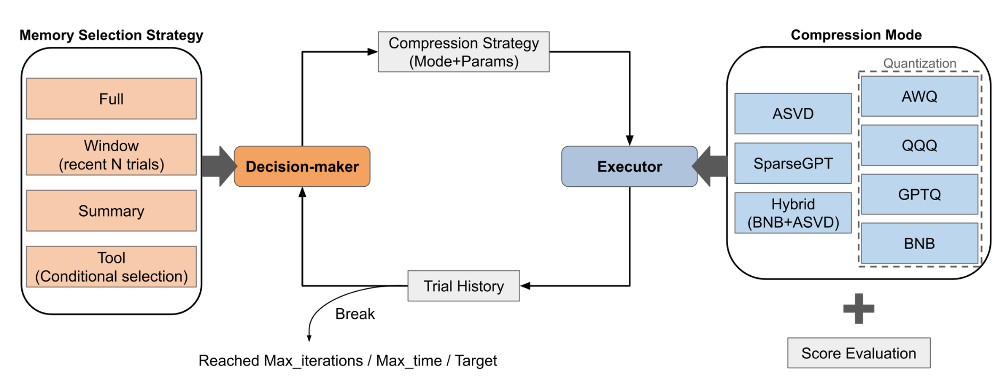
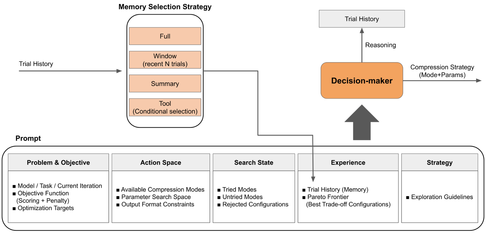
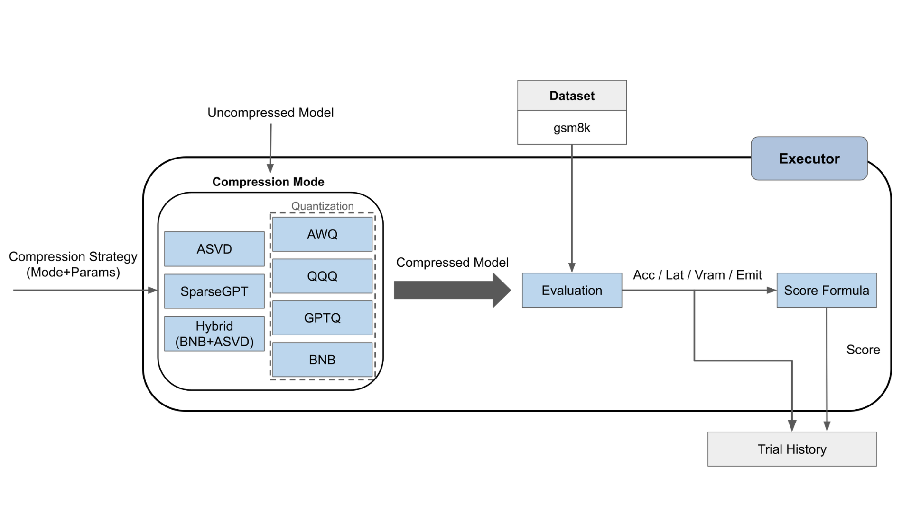
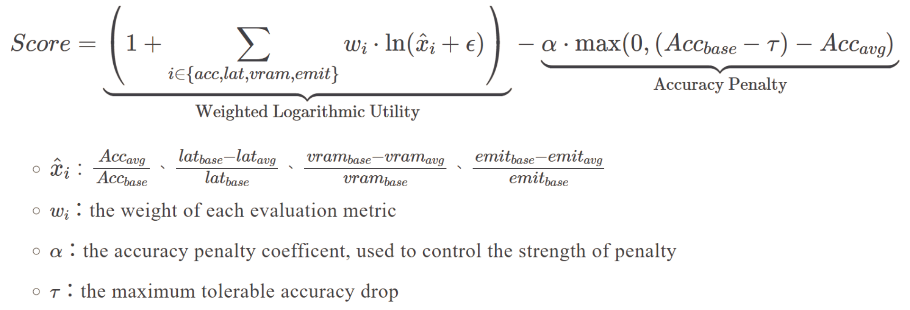
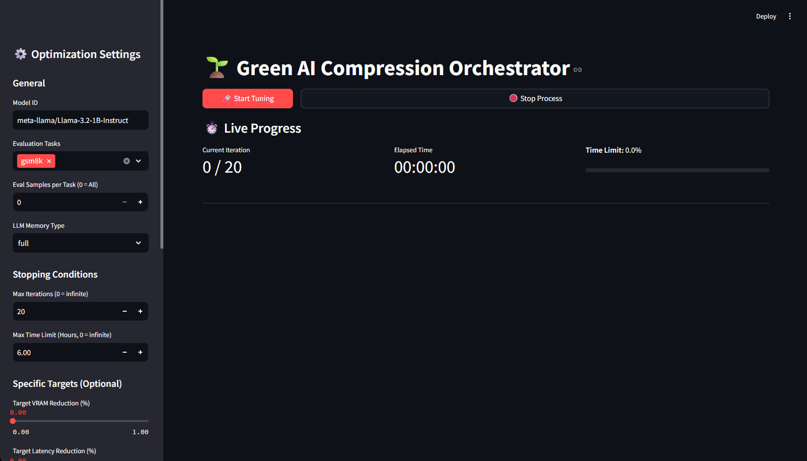

# 🌱 Green AI Compression Orchestrator

**用 LLM Agent 取代黑盒優化演算法，自動搜尋 LLM 壓縮設定的 Pareto 最優解。**

在「量化 / 低秩分解 / 稀疏化」的壓縮設定空間裡，每個參數都同時牽動 **準確率、推論延遲、VRAM、碳排放** 四個互相拉扯的目標，傳統做法是人工試錯或跑 TPE / 遺傳演算法之類的黑盒優化。這個框架同時實作了 **LLM Agent 決策**與**統計優化（Optuna TPE / NSGA-II / Random）**兩套完整、公平共用同一套執行/計分邏輯的搜尋範式，可以互相替換、比較。

完整的實驗設計與比較結論見 [`docs/EXPERIMENT_OVERVIEW.md`](docs/EXPERIMENT_OVERVIEW.md)，或直接跑互動儀表板即時查驗（見下方）。

---

## 目錄

- [系統架構](#系統架構)
- [壓縮方法庫](#壓縮方法庫)
- [Repo 結構](#repo-結構)
- [安裝](#安裝)
- [使用方式](#使用方式)
- [文件索引](#文件索引)

---

## 系統架構



- **`src/Global_Tuner/`** — LLM 決策版本。每輪依記憶策略組成 prompt，交給 LLM 選下一組壓縮設定，內建即時 Streamlit 儀表板、彈性停止條件（迭代數 / 時間上限 / 目標達成提早停）、子進程隔離確保 VRAM 100% 釋放。
- **`src/Systematic_Tuner/`** — 統計優化版本，用 Optuna 的 TPE / NSGA-II / Random sampler 取代 LLM 決策，其餘（搜尋空間、執行器、計分公式）與 `Global_Tuner` 完全共用，確保兩邊比較公平。
- **`src/Strategy/`** — 兩個 tuner 共用的核心：`schemas.py`（設定的 Pydantic schema）、`executors.py`（8 種壓縮模式的實際執行與計分邏輯）、`trial_naming.py`。
- **`src/Method/`** — 底層壓縮演算法：`quantize.py`（GPTQ / AWQ / BNB / QQQ）、`asvd.py`（Activation-aware SVD）、`sparse.py`（SparseGPT）。
- **`src/Evals/`** — 5 個評估任務各自獨立的 evaluator（見下）。

<details>
<summary>Decision-maker prompt 結構 / Executor 壓縮流程 / 計分公式（點開圖）</summary>





</details>

### LLM 的 4 種記憶策略（`--memory_type`）

| 策略 | 做法 | 取捨 |
|---|---|---|
| `full` | 每輪把完整歷史丟給 LLM | 資訊最完整，但 token 成本最高、易受長上下文干擾 |
| `window` | 只給最近 N 筆 trial | 省 token，但可能忘記早期教訓、重蹈覆轍 |
| `summary` | 用次要 LLM 定期把歷史濃縮成「知識摘要」 | 保留長期洞察且省 token，但多一次摘要呼叫、偶有失真 |
| `tool` | 給 LLM 一個 `retrieve_trials` 工具，主動檢索相關歷史 | 最貼近人類 debug 方式，基礎 prompt 最精簡 |

---

## 壓縮方法庫

| 方法 | 類型 | 原理 |
|---|---|---|
| **GPTQ / GPTQ v2** | 量化 | Hessian-based 權重量化，支援 2/3/4/8 bit |
| **AWQ** | 量化 | Activation-aware 量化，固定 4bit，需 Ampere+ GPU |
| **QQQ** | 量化 | W4A8，INT8 GEMM 推理最快 |
| **BNB (BitsAndBytes)** | 量化 | On-the-fly 量化，不需存檔，適合搭配其他方法做 hybrid |
| **ASVD** | 低秩分解 | 用校準資料集估計激活分布做 SVD 截斷；Fisher 資訊矩陣優先保留對 loss 影響大的維度 |
| **SparseGPT**（非結構化 / 2:4 / 4:8） | 剪枝 | 非結構化或硬體友善的結構化稀疏化 |
| **KV Cache 壓縮**（SnapKV / K-Norm / StreamingLLM） | 推理優化 | 剔除 Attention 中不重要的 KV 對以降低顯存壓力 |
| **Hybrid** | 組合 | sparse→quant 或 asvd→bnb |

評估任務：**GSM8K**（數學推理）、**BBH**、**CommonsenseQA**、**HumanEval**、**TruthfulQA**，各自獨立實作 evaluator（`src/Evals/`）；每個實驗先跑未壓縮 baseline 並智慧快取，供後續所有 trial 共用比較基準。

---

## Repo 結構

```
├── src/                   # 核心程式碼
│   ├── Global_Tuner/      #   LLM 決策 orchestrator + 儀表板
│   ├── Systematic_Tuner/  #   Optuna 統計優化 orchestrator
│   ├── Strategy/          #   兩個 tuner 共用的執行/計分邏輯
│   ├── Method/            #   壓縮演算法實作
│   └── Evals/             #   5 個評估任務的 evaluator
├── dashboard/             # Streamlit 互動報表（讀取 results/ 底下的實驗數據）
├── results/
│   ├── runs/              #   搜尋方法比較實驗（20trial / 30trial / 30trial_noretry / llmc）
│   ├── legacy_eval/       #   早期單一壓縮設定的驗證性實驗（1B/3B/8B，5 個任務）
│   └── notebooks/         #   資料分析 notebook
├── analysis/              # 針對特定實驗批次的一次性分析腳本
├── docs/                  # 實驗總覽、質化分析、消融實驗報告
├── png/                   # README / docs 用的架構圖
├── legacy/                # 舊版、跟 src/ 介面不相容的凍結程式碼（僅供參考，不對外維護）
└── ASVD4LLM/ KvPress/ codecarbon/   # 第三方相依專案
```

---

## 安裝

```bash
conda env create -f environment.yml
conda activate green-ai-compression-orchestrator

# torch 需先裝對應 CUDA 版本，gptqmodel 需要 --no-build-isolation
pip install torch --index-url https://download.pytorch.org/whl/cu128
pip install -v gptqmodel --no-build-isolation --force-reinstall --no-cache-dir
pip install -r requirements.txt
```

### 環境變數

複製 [`.env.example`](.env.example) 為 `.env`（放在 repo 根目錄），填入：

| 變數 | 必填 | 用途 |
|---|---|---|
| `LLM_API_KEY` | LLM 決策模式必填 | OpenAI API key（`src/Global_Tuner/`），決策與 `summary` 記憶策略的摘要呼叫都會用到 |
| `LLM_MODEL` | 選填 | 決策用的模型，預設 `gpt-4o` |
| `SUMMARY_MODEL` | 選填 | `summary` 記憶策略用來壓縮歷史的次要模型，預設 `gpt-4o-mini` |
| `HF_TOKEN` | 下載 Llama 系列模型必填 | Llama 在 HuggingFace 上是 gated model，需要先在對應模型頁面（例如 [meta-llama/Llama-3.2-3B-Instruct](https://huggingface.co/meta-llama/Llama-3.2-3B-Instruct)）申請存取權限，再到 [huggingface.co/settings/tokens](https://huggingface.co/settings/tokens) 建立 token |

只跑 `src/Systematic_Tuner/`（統計優化，不經過 LLM）可以不設 `LLM_API_KEY`；但下載模型本身仍需要 `HF_TOKEN`。

---

## 使用方式

### 互動儀表板（推薦）

視覺化比較所有實驗批次、Pareto 散佈圖、trial 明細：

```bash
streamlit run dashboard/app.py
```

### LLM Agent 決策（單次執行）

```bash
python src/Global_Tuner/orchestrator.py \
  --model_id "meta-llama/Llama-3.2-1B-Instruct" \
  --task "gsm8k" \
  --memory_type full \
  --max_iterations 20 \
  --max_time_hours 6.5 \
  --target_vram_pct 0.5 \
  --target_acc_drop 0.05 \
  --patience 3
```

也可以用同一支腳本直接跑「4 種記憶策略」的自動化 benchmark：

```bash
python src/Global_Tuner/orchestrator.py --benchmark_runs 3 --max_iterations 15
```

或改用 Streamlit UI 啟動（跟上面 CLI 參數一一對應）：

```bash
streamlit run src/Global_Tuner/app.py
```



### 統計優化基線（TPE / NSGA-II / Random）

```bash
python -m src.Systematic_Tuner.orchestrator \
  --model_id meta-llama/Llama-3.2-1B-Instruct \
  --task gsm8k \
  --search_method optuna
```

更多參數（搜尋空間、資源限制、輸出格式）見 [`src/Global_Tuner/README.md`](src/Global_Tuner/README.md)、[`src/Systematic_Tuner/README.md`](src/Systematic_Tuner/README.md)。

---

## 文件索引

- [`docs/EXPERIMENT_OVERVIEW.md`](docs/EXPERIMENT_OVERVIEW.md) — 實驗方法、目標、完整成果總覽
- [`docs/final_results_analysis.md`](docs/final_results_analysis.md) — LLM reasoning 的質化分析
- [`docs/llm_reasoning_findings.md`](docs/llm_reasoning_findings.md) — 4 種記憶策略各自的行為模式與盲點
- [`docs/retry_ablation_analysis.md`](docs/retry_ablation_analysis.md) — 重複設定安全網消融實驗
